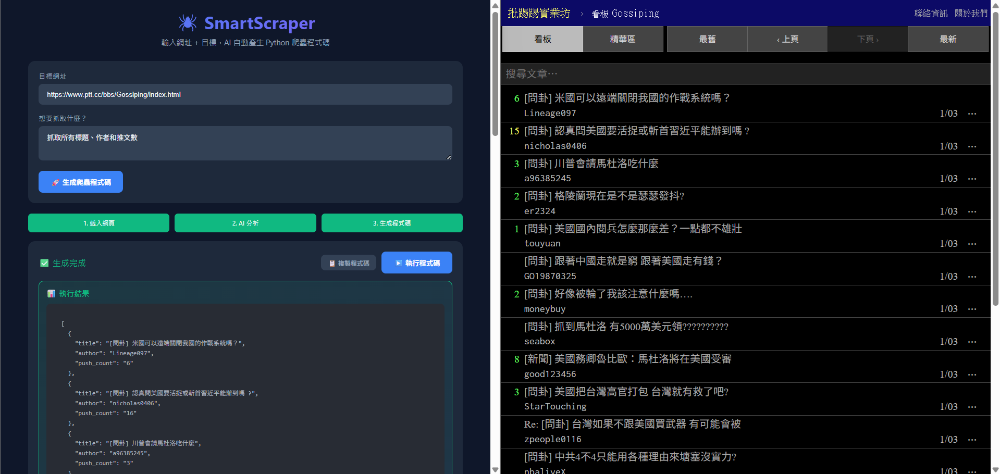
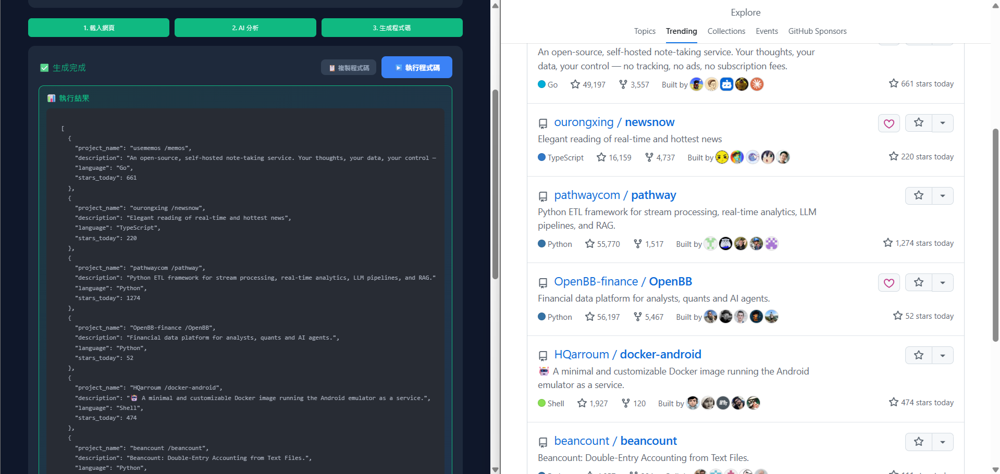
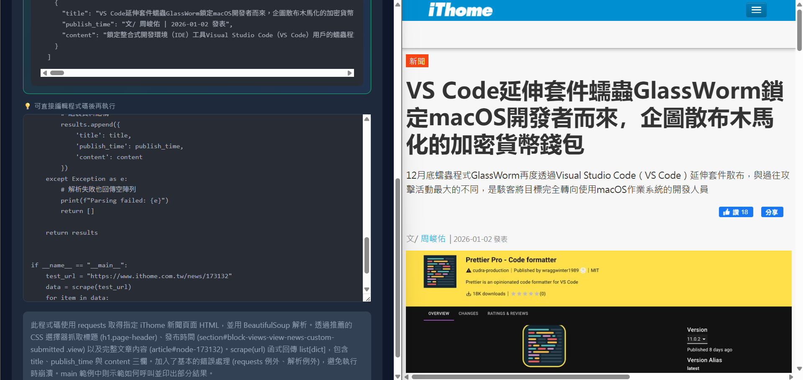
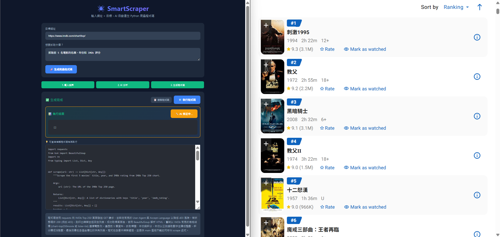

# SmartScraper 🕷️

AI 驅動的爬蟲生成器 - 輸入 URL + 目標，自動產生 Python 爬蟲程式碼

## Quick Start

```bash
# 安裝依賴
uv sync

# 安裝 Playwright 瀏覽器
uv run playwright install chromium

# 設定環境變數
cp .env.example .env
# 編輯 .env 填入 Azure OpenAI 設定

# 啟動服務
uv run python main.py

# 開啟瀏覽器
http://localhost:8081
```

## 測試過的模型配置

> ⚠️ **重要**：以下模型配置經過實測，使用其他模型可能效果不同

| 用途 | 推薦模型 | 說明 |
|------|----------|------|
| **網頁分析** | `gpt-5.2-chat` | 理解網頁結構、使用者意圖 |
| **程式碼生成** | `gpt-5.1-codex-max` | 專為程式碼優化 |

### .env 設定範例
```bash
AZURE_OPENAI_ENDPOINT=https://your-endpoint.openai.azure.com/
AZURE_OPENAI_API_KEY=your-api-key
AZURE_OPENAI_CHAT_DEPLOYMENT=gpt-5.2-chat       # 分析用
AZURE_OPENAI_CODEX_DEPLOYMENT=gpt-5.1-codex-max # 程式碼生成用
AZURE_OPENAI_API_VERSION=2025-04-01-preview
```

## 🏆 實戰展示 (Showcase)

SmartScraper 能夠應對多種不同的網頁結構：

| 類型 | 網站 | 展示 |
|------|------|------|
| **列表 (List)** | PTT 八卦版 |  <br> *自動處理 18+ 驗證與列表爬取* |
| **表格 (Grid)** | GitHub Trending |  <br> *精準抓取專案與星數* |
| **單頁 (Single)** | iThome 新聞 |  <br> *提取內文與發布時間* |

### 🔧 獨家功能：AI 自動修復 (Self-Healing)

當爬蟲因為網頁改版或邏輯錯誤而執行失敗時，SmartScraper 能自動診斷並修復：

| 🔴 執行失敗 (Before) | 🟢 AI 自動修復 (After) |
|-------------------|----------------------|
|  <br> *因 IMDb 反爬蟲機制或結構變更導致空結果* |  <br> *點擊「AI 自動修正」後，AI 修正邏輯成功抓取資料* |


## API 自動切換

本專案支援 **Responses API** 和 **Completions API** 自動切換：

- 優先嘗試 Responses API (較新，自動處理 function calling)
- 若不可用，自動降級為 Completions API
- 啟動時會顯示: `📡 Responses API: 可用/不可用`

## API Endpoints

| 路徑 | 功能 |
|------|------|
| `GET /` | 網頁介面 |
| `POST /analyze` | 分析網頁結構 |
| `POST /generate` | 生成爬蟲程式碼 |
| `POST /execute` | 沙箱執行程式碼 |
| `POST /full` | 一鍵完成全流程 |

## 使用範例

### 網頁介面
打開 `http://localhost:8081`，輸入網址和目標即可。

### API 呼叫
```bash
# 生成爬蟲程式碼
curl -X POST http://localhost:8081/generate \
  -H "Content-Type: application/json" \
  -d '{"url": "https://www.stockq.org/", "goal": "抓取美元指數和價格"}'

# 完整流程 (分析 → 生成 → 執行)
curl -X POST http://localhost:8081/full \
  -H "Content-Type: application/json" \
  -d '{"url": "https://www.stockq.org/", "goal": "抓取美元指數"}'
```

## 架構

```
SmartScraper/
├── main.py                    # FastAPI 入口 (port 8081)
├── static/
│   └── index.html             # 網頁介面
├── browser/
│   └── playwright_client.py   # 瀏覽器封裝
├── agents/
│   ├── openai_client.py       # Azure OpenAI 統一客戶端 (MAF Responses API)
│   ├── analyzer.py            # 頁面分析 (gpt-5.2-chat)
│   └── generator.py           # 程式碼生成 (gpt-5.1-codex-max)
└── sandbox/
    └── executor.py            # 安全執行環境
```

## UI 設計原則

### 步驟指示器
- **只有當前步驟亮起** (active) - 讓使用者明確知道目前執行到哪個步驟
- **已完成步驟顯示暗色** (done) - 區分已完成和進行中

### 互動與回饋
- **程式碼編輯器** - 允許使用者在執行前手動微調生成的程式碼
- **即時執行與結果** - 執行結果置頂顯示，立即獲得回饋
- **AI 自動修正** - 
    - 當執行失敗 (Exception) 或抓不到資料 (Null) 時
    - 自動顯示「🔧 AI 自動修正」按鈕
    - 點擊後 AI 會根據錯誤訊息嘗試修復程式碼
- **未開始步驟保持灰色** - 預設狀態

```
執行中:  [✓ 載入網頁] [● AI 分析] [ 生成程式碼]
                        ↑ 亮起
```

### 使用者回饋
- 按鈕狀態變化反映處理進度
- 錯誤訊息即時顯示
- 成功後顯示程式碼 + 執行按鈕

## 安全性

- 生成的程式碼在受限沙箱中執行
- 禁止危險函數: `exec`, `eval`, `os.system`, `subprocess`
- 只允許白名單模組: `requests`, `bs4`, `json`, `re`, `datetime`, `typing`, `collections`, `urllib`

## ⚠️ 免責聲明 (Disclaimer)

1. **僅供學習與研究用途**：本專案 (SmartScraper) 旨在展示 AI 輔助程式碼生成與自動化技術，僅供技術研究與學術交流使用。
2. **使用者責任**：使用者在使用本工具進行網頁抓取時，務必遵守目標網站的：
    - `robots.txt` 爬蟲協議
    - 網站服務條款 (Terms of Service)
    - 相關著作權法規與隱私權規範
3. **無擔保**：本工具不保證抓取程式碼的永久有效性（網頁結構隨時可能變動）。
4. **責任歸屬**：開發者不對使用者利用本工具進行的任何侵權、攻擊或違法行為承擔法律責任。請理性使用，避免對目標伺服器造成過大負擔。

---

*開發者: breezy89757 | 授權: MIT*
